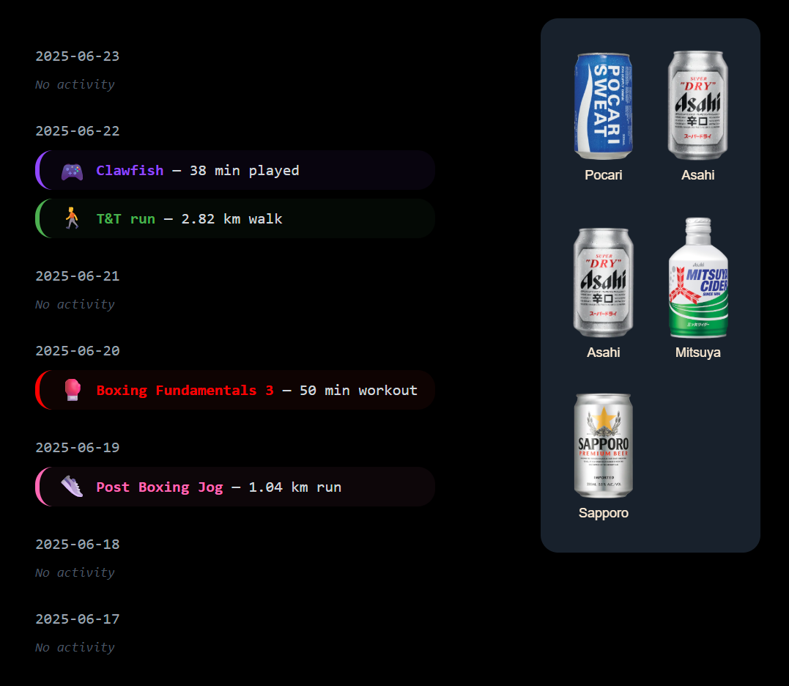

# Overview
This repo includes the data-snapshot jobs, server, and frontend for my can collection (i.e. sapporo), Steam, Strava, and other things.

## Web setup
The react-app runs locally on my PC and is tunneled to my domain (ben-feed.cc) through a cloudflare tunnel. This means the production-website you see is a mirror of the local application running on my PC. I wrote a server that authenticates with Instagram, Strava, Github, etc. to fetch my data. This server is exposed through another cloudflare tunnel.

```
  +---------------------+       +----------------------+       +-------------------+
  |   Internet User     |  -->  |  Cloudflare Edge     |  -->  |  Tunnel 1         |
  | (visits your app)   |       | (HTTPS/DDoS/Proxy)   |       | (frontend-tunnel) |
  +---------------------+       +----------------------+       +-------------------+
          ↑                                                     ↓
          |                                     +-----------------------------------+
          |                                     | Your Local Machine                |
          |                                     |                                   |
          |                                     |  +-------------+                  |
          |                                     |  |  Frontend   |                  |
          |                                     |  | (Port: 3000)|                  |
          |                                     |  +-------------+                  |
          |                                     |                                   |
          +-------------------------------------+-----------------------------------+
                                  Secure Tunnel 1 (outbound)
                                  Routes to frontend (e.g., `app.yourdomain.com`)


  +---------------------+       +----------------------+       +-------------------+
  |   API Client        |  -->  |  Cloudflare Edge     |  -->  |  Tunnel 2         |
  | (calls your API)    |       | (HTTPS/DDoS/Proxy)   |       | (backend-tunnel)  |
  +---------------------+       +----------------------+       +-------------------+
          ↑                                                     ↓
          |                                     +-----------------------------------+
          |                                     | Your Local Machine                |
          |                                     |                                   |
          |                                     |                  +-------------+  |
          |                                     |                  |   Backend   |  |
          |                                     |                  | (Port: 5000)|  |
          |                                     |                  +-------------+  |
          |                                     |                                   |
          +-------------------------------------+-----------------------------------+
                                  Secure Tunnel 2 (outbound)
                                  Routes to backend (e.g., `api.yourdomain.com`)
```
Pros
1. local changes are immediately shipped

Cons
1. local changes are immediately shipped

Tips
1. Allowlisted `cloudflared` for both private and public firewalls

I would normally host this on Heroku or run it on an EC2 instance. I like this tunneling approach because it is straightforward. Any syntax error will bring it down. 

See https://developers.cloudflare.com/cloudflare-one/connections/connect-networks/do-more-with-tunnels/local-management/create-local-tunnel/ for setup.


## Data Fetching

### Steam

See [Steam API documentation](https://developer.valvesoftware.com/wiki/Steam_Web_API#GetGlobalAchievementPercentagesForApp_.28v0001.29). I setup a workflow that calls the Steam API for my *recently played games* and figures out which of those games I played each day. You'll find the script in `~/data/steam/`. I schedule the jobs with Windows Task Scheduler, which is basically a cron job.


```
{
  "date": "2025-06-22",
  "steam": [
    {
      "appid": 1621140,
      "name": "Clawfish",
      "minutes_played_today": 38,
      "minutes_played_total": 38
    }
  ]
}
```

### Strava

See [Strava API documentation](https://developers.strava.com/docs/). I setup a similar workflow for Strava that will record my acitvities.

```
{
  "date": "2025-06-22",
  "strava": [
    {
      "id": 14885386852,
      "title": "T&T run",
      "type": "Walk",
      "metricValue": "2.82",
      "metricLabel": "km",
      "time": 45,
      "date": "2025-06-22T14:11:01Z"
    }
  ]
}
```

## Server
Manages authentication/tokens for querying data from Instagram, Strava, Github, etc.
APIs:
1. `GET https://api.ben-feed.cc/activity`
1. `GET https://api.ben-feed.cc/cans/recent`
1. `POST https://api.ben-feed.cc/cans/update`
1. `GET https://api.ben-feed.cc/instagram/posts`
1. `GET https://api.ben-feed.cc/github/commits/`

## Frontend
A react webapp that uses vite and tailwind.
Directly calls these APIs for data:
1. Chess.com public api for my latest game
1. `GET https://api.farmsense.net/v1/moonphases/?d=${unixTime}` (farmsense API for moon phase)
1. `GET https://api.sunrisesunset.io/json?lat=${latitude}&lng=${longitude}` (for sunset/sunrise/dusk times)
1. `GET https://api.open-meteo.com/v1` (open-meteo api for detailled weather)

